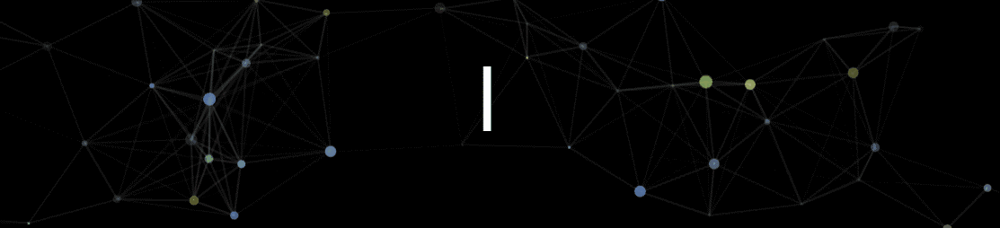
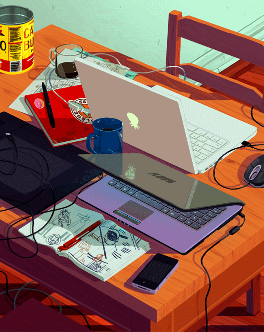

<!--  -->
<!-- https://codesandbox.io/p/sandbox/readme-introgif-9fjo5?file=%2Fsrc%2Fmain.js%3A1%2C1-35%2C9-->

  <h1>Hi there, I'm <a href="https://github.com/CarlosBuustos">Carlos 🔍</a></h1> 
  <!--    -->
  

<!--     -->

 
I am a CS+Physics undergraduate student currently based in  <b>Salamanca, Spain.</b> Deeply passionate about Machine Learning and Neural Networks, I took part of different international internships in places such as  
  <b>Kracow</b> and  <b>Pavia</b>. I'm also the creator of <a href="https://carlosbustos.hashnode.dev/" target="_blank">Scientific Chronics</a>
, a personal blog where I weekly elaborate articles about scientific topics or stories. I'm not extremely active on my GitHub, but feel free to look around :)

<!--<table>
  <tr>
    <td>-->
      <h2>Projects:</h2>
      <ul>
        <li>
          <a href="https://github.com/CarlosBuustos/IFJ_Neuronal_Network" target="_blank">
            <b>💥 MuonE Detector CERN</b>
          </a>
           
          <i>Deep Neural Network (DNN) for Identifying Particle Tracks in Muon–Electron Collision</i>
        </li>
        <li>
          <a href="https://carlosbustos.site" target="_blank">
            <b>✍🏻 Scientific Chronics</b>
          </a> 
          <i>A Blog where I share my journey, thoughts, and learning</i>
        </li>
        <li>
          <a href="https://github.com/CarlosBuustos/MamoGraph_AI" target="_blank">
            <b>🧑🏻‍⚕️ Mamograph.AI</b>
          </a>
           
          <i>Deep Learning AI tool for the early detection of breast cancer</i>
        </li>
        <li>
          <a href="https://github.com/CarlosBuustos/Renfe.fails" target="_blank">
            <b>🚅 Renfe.fails (unfinished)</b>
          </a> 
          <i>Web where I visibly show the delays and cancellations of the Spanish train company Renfe</i>
        </li>
        <li>
          <a href="https://github.com/CarlosBuustos/Particle-Hunt" target="_blank">
            <b>⚛️ Particle Hunt – Hypathia</b>
          </a> 
          <i>Identifying high–energy particles in the outer detector regions. 
          Run events 1 & 2 (2021) CMS experiment, CERN</i>
        </li>
        <li>
          <a href="https://github.com/CarlosBuustos/Fourier-Lab" target="_blank">
            <b>〰️ Fourier Transformation</b>
          </a> 
          <i>Interactive experiments visualizing how complex signals decompose into simpler waveforms 
          through the Fast Fourier Transform -> fft</i>
        </li>
      </ul>
      <!--
    </td>
    <td align="right" valign="bottom" width="35%">
      
    </td>
  </tr>
</table>-->

<h2>Get in Touch</h2>

  
<a href="https://carlosbustos.hashnode.dev/" target="_blank"> 

